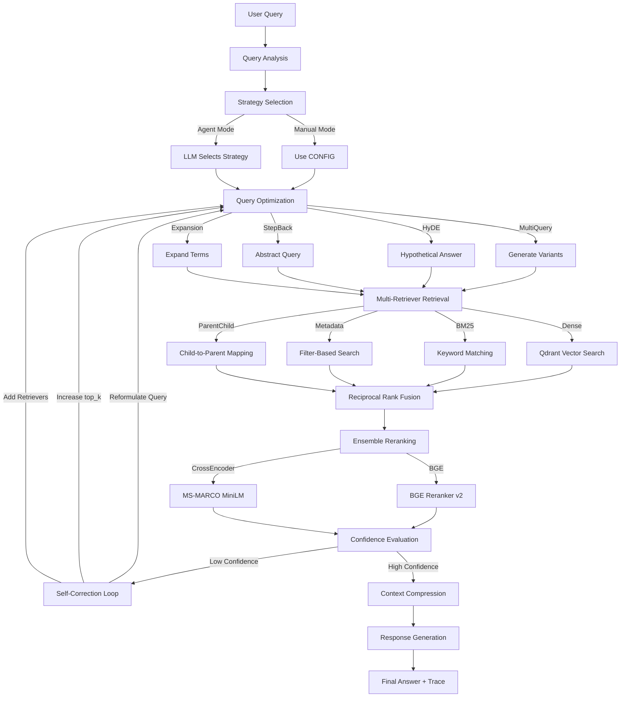
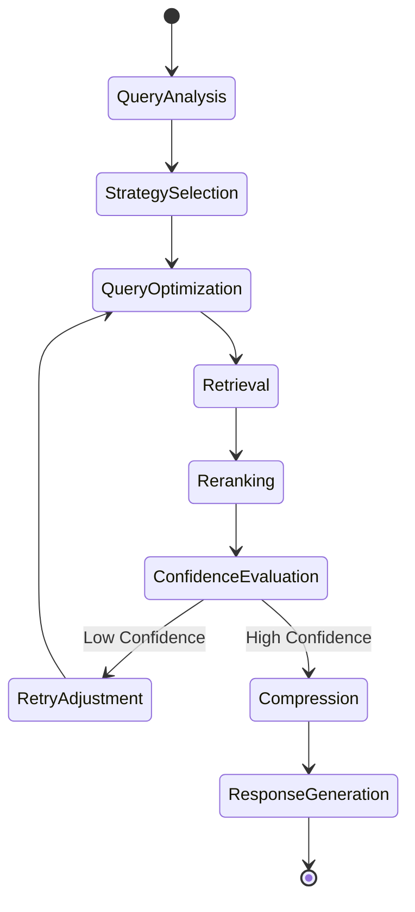

# RARE: Research-Grade Agentic Retrieval Engine

A self-contained Kaggle notebook implementing a configurable, benchmarkable, and explainable retrieval engine for Agentic AI systems.

Built with **Ollama** (local LLMs only), **LangGraph** (workflow orchestration), **Qdrant** (vector storage), and **DeepEval** (evaluation).

---

## Architecture Overview

RARE is a modular retrieval pipeline where every component is configurable via a single dictionary. It supports two modes:

- **Manual Mode**: The user specifies exact chunking, retrieval, reranking, query optimization, and compression strategies with explicit weights.
- **Agent Mode**: An LLM autonomously selects the optimal strategy based on query type and document characteristics.

The pipeline is orchestrated as a **LangGraph state machine** with conditional routing for self-correcting retrieval.

---

## Architecture Diagram



---

## LangGraph Workflow



---

## Features

### Document Ingestion
- PDF (via PyMuPDF)
- DOCX (via python-docx)
- CSV (via pandas)
- TXT (paragraph-based splitting)
- Markdown (header-based splitting)
- Automatic type detection and metadata extraction

### Chunking Strategies
| Strategy | Description |
|----------|-------------|
| Fixed | Equal-size chunks with configurable overlap |
| Recursive | Natural boundary splitting (paragraphs, sentences, words) |
| Semantic | Embedding-based breakpoint detection via SemanticChunker |
| Parent-Child | Two-level hierarchy: large parents, small retrieval children |
| Document-Aware | Adapts strategy based on document type (PDF, CSV, MD, etc.) |

### Retrieval Methods
| Method | Description |
|--------|-------------|
| Dense | Embedding similarity via Qdrant vector search |
| BM25 | Keyword matching via rank_bm25 |
| Metadata | LLM-extracted keyword filtering |
| Parent-Child | Child retrieval mapped to parent documents |

### Query Optimization
| Strategy | Description |
|----------|-------------|
| Multi-Query | LLM generates 3 alternative query phrasings |
| Query Expansion | LLM expands query with related terms and synonyms |
| HyDE | LLM generates hypothetical answer as search query |
| Step-Back | LLM creates abstract version for broader retrieval |

### Reranking
| Reranker | Model |
|----------|-------|
| BGE | BAAI/bge-reranker-v2-m3 |
| Cross-Encoder | cross-encoder/ms-marco-MiniLM-L-6-v2 |

Supports weighted ensemble: `score = w1 * bge_score + w2 * ce_score`

### Context Compression
| Strategy | Description |
|----------|-------------|
| Redundancy Removal | Content-hash deduplication |
| Contextual | LLM extracts query-relevant sentences per document |
| LLM | LLM summarizes combined context into concise passage |

### Self-Correcting Retrieval
When retrieval confidence falls below threshold:
1. Reformulates query with additional optimizers
2. Increases top_k by 50%
3. Broadens retriever set
4. Maximum retries configurable

---

## Configuration

All behavior is controlled from a single configuration cell:

```python
OLLAMA_CONFIG = {
    "generation_model": "llama3",
    "embedding_model": "nomic-embed-text",
    "query_optimizer_model": "llama3",
    "evaluation_model": "llama3",
}

CONFIG = {
    "agent_mode": False,
    "chunkers": {
        "semantic": 0.5,
        "parent_child": 0.3,
        "recursive": 0.2,
    },
    "retrievers": {
        "dense": 0.5,
        "bm25": 0.3,
        "metadata": 0.2,
    },
    "rerankers": {
        "bge": 0.7,
        "cross_encoder": 0.3,
    },
    "query_optimizers": ["multi_query", "hyde", "step_back"],
    "compression": "contextual",
    "top_k": 15,
    "confidence_threshold": 0.85,
    "max_retries": 3,
}

DOCUMENTS = ["path/to/doc1.pdf", "path/to/doc2.txt"]
```

Changing this configuration completely changes system behavior. No source code modifications required.

---

## Benchmark Results

Benchmarking produces three output files:

| File | Description |
|------|-------------|
| `benchmark_results.csv` | Raw metrics for each configuration |
| `leaderboard.csv` | Configurations ranked by composite score |
| `comparison_report.md` | Formatted markdown comparison report |

Configurations tested:
- Dense Only
- BM25 Only
- Hybrid (Dense + BM25)
- Hybrid + MultiQuery
- Hybrid + HyDE
- Full Pipeline

---

## Evaluation

Integrated **DeepEval** with Ollama for local evaluation:

| Metric | Description |
|--------|-------------|
| Faithfulness | Answer grounded in retrieved context |
| Context Precision | Relevant documents ranked higher |
| Context Recall | Necessary information present in context |
| Answer Relevancy | Response addresses the actual query |
| Hallucination | Claims not supported by source documents |

Output: `evaluation_results.csv`

---

## LangSmith Observability

Optional LangSmith integration for full pipeline tracing:
- Add `LANGSMITH_API_KEY` to Kaggle Secrets
- Every LangGraph node is individually traceable
- Benchmark configurations appear as separate traces
- System never fails if LangSmith is unavailable

---

## Quick Start

1. Create a new Kaggle notebook with **GPU enabled** and **Internet enabled**
2. Upload `rare_engine.ipynb`
3. Run all cells
4. Modify `CONFIG` to experiment with different strategies
5. Uncomment evaluation/benchmark cells to generate reports

---

## Project Structure

```
rare_engine.ipynb    # Complete Kaggle notebook (primary deliverable)
rare_engine.py       # Python script backup
README.md            # This file
```

---

## Technology Stack

| Component | Technology |
|-----------|-----------|
| LLM Runtime | Ollama (local, no cloud APIs) |
| Framework | LangChain + LangGraph |
| Vector Store | Qdrant (local mode) |
| BM25 | rank_bm25 |
| Reranking | FlagEmbedding (BGE) + sentence-transformers |
| Evaluation | DeepEval |
| Observability | LangSmith (optional) |
| Document Parsing | PyMuPDF, python-docx, pandas |
