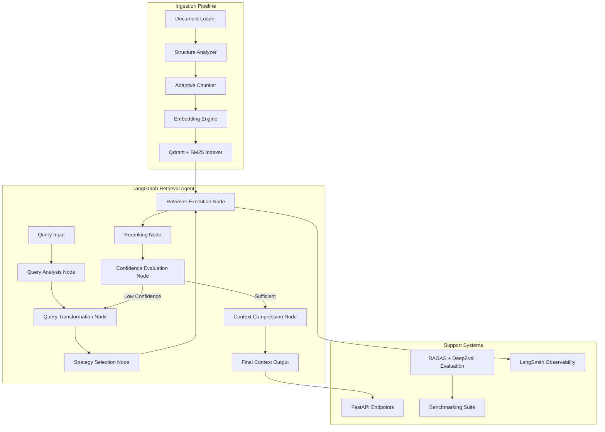
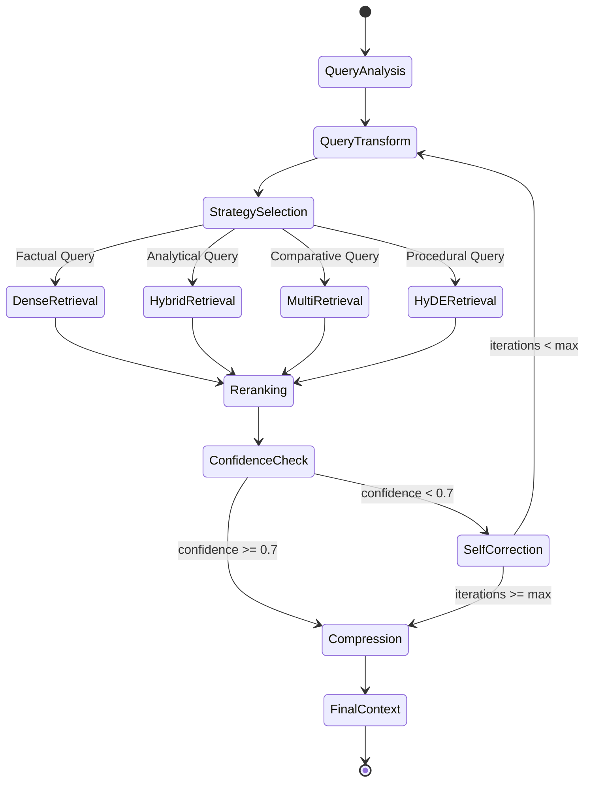

# Production-Grade RAG Retrieval Engine — Implementation Plan

## Overview

Build a **modular, adaptive RAG retrieval platform** designed as reusable infrastructure for Agentic AI systems. The engine dynamically selects chunking, retrieval, reranking, and compression strategies based on query classification and document structure analysis. All models are local GPU-hosted via vLLM/Ollama, swappable through YAML config.

### Core Architecture



---

## User Review Required

> [!IMPORTANT]
> **GPU Hardware**: This plan assumes you have a GPU with ≥24GB VRAM to run Qwen3-14B via vLLM. If your GPU has less VRAM, I'll adjust to use Qwen3-8B or smaller quantized models. Please confirm your GPU specs.

> [!IMPORTANT]
> **vLLM vs Ollama**: The plan uses **vLLM** as the primary LLM serving backend (OpenAI-compatible API). If you prefer Ollama for easier setup, I can make it the default with vLLM as an alternative. Both are supported via the config layer.

> [!WARNING]
> **Qdrant Deployment**: The plan uses Qdrant via Docker for the vector store. Alternatively, I can use Qdrant's in-memory mode for development (no Docker required) and Docker for production. Please confirm your preference.

---

## Open Questions

> [!IMPORTANT]
> 1. **Sample Documents**: Do you have specific documents/datasets you want to ingest for testing, or should I include a synthetic dataset generator and sample PDFs?
> 2. **Redis**: The spec lists Redis as optional. Should I include Redis-based caching for embeddings and query results now, or defer it to a future phase?
> 3. **DeepEval**: Should I integrate DeepEval alongside RAGAS, or focus primarily on RAGAS with DeepEval as a secondary option?

---

## Proposed Changes

### Project Structure

```
RAG Agentic AI Tool/
├── config/
│   ├── models.yaml              # [NEW] Central model configuration
│   ├── retrieval.yaml            # [NEW] Retrieval strategy configs
│   ├── chunking.yaml             # [NEW] Chunking strategy configs
│   └── settings.py               # [NEW] Pydantic settings loader
│
├── src/
│   ├── __init__.py
│   │
│   ├── core/                     # Core abstractions & DI
│   │   ├── __init__.py
│   │   ├── interfaces.py         # [NEW] ABC interfaces for all components
│   │   ├── registry.py           # [NEW] Component registry & factory
│   │   ├── models.py             # [NEW] Pydantic data models
│   │   └── exceptions.py         # [NEW] Custom exception hierarchy
│   │
│   ├── ingestion/                # Document ingestion pipeline
│   │   ├── __init__.py
│   │   ├── loader.py             # [NEW] Multi-format document loader
│   │   ├── analyzer.py           # [NEW] Document structure analyzer
│   │   └── pipeline.py           # [NEW] Ingestion orchestrator
│   │
│   ├── chunking/                 # Advanced chunking strategies
│   │   ├── __init__.py
│   │   ├── base.py               # [NEW] Base chunker interface
│   │   ├── fixed.py              # [NEW] Fixed-size chunking
│   │   ├── recursive.py          # [NEW] Recursive character chunking
│   │   ├── semantic.py           # [NEW] Semantic similarity chunking
│   │   ├── parent_child.py       # [NEW] Parent-child hierarchical chunking
│   │   ├── document_aware.py     # [NEW] Structure-aware chunking
│   │   └── selector.py           # [NEW] Auto chunking strategy selector
│   │
│   ├── embeddings/               # Embedding layer
│   │   ├── __init__.py
│   │   ├── base.py               # [NEW] Base embedding interface
│   │   ├── hf_embeddings.py      # [NEW] HuggingFace/SentenceTransformers
│   │   ├── bge_m3.py             # [NEW] BGE-M3 dense+sparse embeddings
│   │   └── manager.py            # [NEW] Embedding model manager
│   │
│   ├── indexing/                  # Vector store & sparse index
│   │   ├── __init__.py
│   │   ├── qdrant_store.py       # [NEW] Qdrant vector store wrapper
│   │   ├── bm25_store.py         # [NEW] BM25 sparse index
│   │   ├── hybrid.py             # [NEW] Hybrid retrieval (RRF, weighted)
│   │   └── manager.py            # [NEW] Index lifecycle manager
│   │
│   ├── query/                    # Query understanding layer
│   │   ├── __init__.py
│   │   ├── classifier.py         # [NEW] Query type classifier
│   │   ├── expander.py           # [NEW] Multi-query & query expansion
│   │   ├── hyde.py               # [NEW] HyDE implementation
│   │   ├── step_back.py          # [NEW] Step-back prompting
│   │   └── transformer.py        # [NEW] Query transformation orchestrator
│   │
│   ├── retrieval/                # Retrieval execution
│   │   ├── __init__.py
│   │   ├── dense.py              # [NEW] Dense vector retriever
│   │   ├── sparse.py             # [NEW] BM25 sparse retriever
│   │   ├── hybrid.py             # [NEW] Hybrid retriever
│   │   ├── metadata_filter.py    # [NEW] Metadata-aware filtering
│   │   └── strategy.py           # [NEW] Strategy selector
│   │
│   ├── reranking/                # Reranking layer
│   │   ├── __init__.py
│   │   ├── base.py               # [NEW] Base reranker interface
│   │   ├── bge_reranker.py       # [NEW] BGE Reranker v2 M3
│   │   ├── cross_encoder.py      # [NEW] Cross-encoder reranker
│   │   └── manager.py            # [NEW] Reranker manager
│   │
│   ├── compression/              # Context compression
│   │   ├── __init__.py
│   │   ├── redundancy.py         # [NEW] Redundancy removal
│   │   ├── contextual.py         # [NEW] Contextual compression
│   │   ├── llm_compress.py       # [NEW] LLM-based compression
│   │   └── optimizer.py          # [NEW] Long-context optimization
│   │
│   ├── agent/                    # LangGraph retrieval agent
│   │   ├── __init__.py
│   │   ├── state.py              # [NEW] Agent state schema
│   │   ├── nodes.py              # [NEW] Graph node implementations
│   │   ├── edges.py              # [NEW] Conditional edge logic
│   │   ├── graph.py              # [NEW] LangGraph workflow builder
│   │   └── self_correct.py       # [NEW] Self-correcting retrieval logic
│   │
│   ├── llm/                      # LLM abstraction layer
│   │   ├── __init__.py
│   │   ├── base.py               # [NEW] Base LLM interface
│   │   ├── vllm_client.py        # [NEW] vLLM OpenAI-compat client
│   │   ├── ollama_client.py      # [NEW] Ollama client
│   │   └── factory.py            # [NEW] LLM factory from config
│   │
│   ├── evaluation/               # Evaluation framework
│   │   ├── __init__.py
│   │   ├── ragas_eval.py         # [NEW] RAGAS metrics integration
│   │   ├── deepeval_eval.py      # [NEW] DeepEval integration
│   │   ├── ir_metrics.py         # [NEW] MRR, NDCG, Recall@K, Precision@K
│   │   ├── report.py             # [NEW] Report generator
│   │   └── datasets.py           # [NEW] Evaluation dataset management
│   │
│   ├── benchmarking/             # Performance benchmarking
│   │   ├── __init__.py
│   │   ├── runner.py             # [NEW] Benchmark orchestrator
│   │   ├── chunker_bench.py      # [NEW] Chunker comparison
│   │   ├── embedding_bench.py    # [NEW] Embedding model comparison
│   │   ├── retriever_bench.py    # [NEW] Retriever comparison
│   │   ├── reranker_bench.py     # [NEW] Reranker comparison
│   │   └── leaderboard.py        # [NEW] Leaderboard generator
│   │
│   └── observability/            # Observability & tracing
│       ├── __init__.py
│       ├── langsmith.py          # [NEW] LangSmith integration
│       ├── telemetry.py          # [NEW] OpenTelemetry setup
│       └── logger.py             # [NEW] Structured logging config
│
├── api/                          # FastAPI application
│   ├── __init__.py
│   ├── main.py                   # [NEW] FastAPI app factory
│   ├── routes/
│   │   ├── __init__.py
│   │   ├── ingest.py             # [NEW] /ingest endpoint
│   │   ├── query.py              # [NEW] /query endpoint
│   │   ├── evaluate.py           # [NEW] /evaluate endpoint
│   │   ├── benchmark.py          # [NEW] /benchmark endpoint
│   │   └── stats.py              # [NEW] /stats endpoint
│   ├── schemas.py                # [NEW] API request/response schemas
│   └── dependencies.py           # [NEW] FastAPI dependency injection
│
├── tests/                        # Test suite
│   ├── __init__.py
│   ├── unit/
│   │   ├── test_chunking.py
│   │   ├── test_embeddings.py
│   │   ├── test_retrieval.py
│   │   ├── test_reranking.py
│   │   └── test_query.py
│   └── integration/
│       ├── test_pipeline.py
│       └── test_agent.py
│
├── docker/
│   ├── Dockerfile                # [NEW] App container
│   ├── Dockerfile.vllm           # [NEW] vLLM serving container
│   └── docker-compose.yaml       # [NEW] Full stack orchestration
│
├── scripts/
│   ├── setup_models.py           # [NEW] Download & verify models
│   ├── run_benchmarks.py         # [NEW] Execute benchmark suite
│   └── generate_eval_data.py     # [NEW] Synthetic eval data generator
│
├── pyproject.toml                # [NEW] Project metadata & deps
├── README.md                     # [NEW] Comprehensive documentation
└── .env.example                  # [NEW] Environment variable template
```

---

### Phase 1: Project Scaffolding & Configuration

**Goal**: Establish project skeleton, dependency management, and the central configuration system.

#### [NEW] [pyproject.toml](file:///c:/Users/Shivansh%20Rana/Desktop/DTU%20Academic/Codes/Python/AIMLPractice/RAG%20Agentic%20AI%20Tool/pyproject.toml)
- Project metadata, Python 3.11+ requirement
- Dependencies organized by groups: core, api, eval, dev
- Core deps: `langchain`, `langgraph`, `langchain-community`, `langchain-experimental`, `langchain-openai`, `qdrant-client`, `sentence-transformers`, `FlagEmbedding`, `pydantic>=2.0`, `pyyaml`, `structlog`
- API deps: `fastapi`, `uvicorn`, `python-multipart`
- Eval deps: `ragas`, `deepeval`
- Observability deps: `langsmith`, `opentelemetry-api`, `opentelemetry-sdk`

#### [NEW] [config/models.yaml](file:///c:/Users/Shivansh%20Rana/Desktop/DTU%20Academic/Codes/Python/AIMLPractice/RAG%20Agentic%20AI%20Tool/config/models.yaml)
- Central model registry: embedding, reranker, generation, query_expansion, evaluation
- Each model entry: provider, model_name, device, max_tokens, base_url (for vLLM)
- Default config uses BGE-M3, BGE Reranker v2 M3, Qwen3-14B

#### [NEW] [config/settings.py](file:///c:/Users/Shivansh%20Rana/Desktop/DTU%20Academic/Codes/Python/AIMLPractice/RAG%20Agentic%20AI%20Tool/config/settings.py)
- Pydantic `BaseSettings` that loads from YAML + env vars
- Validates all config on startup
- Provides typed access to all settings throughout the app

---

### Phase 2: Core Abstractions & Data Models

**Goal**: Define the interfaces, registries, and Pydantic models that all components implement.

#### [NEW] [src/core/interfaces.py](file:///c:/Users/Shivansh%20Rana/Desktop/DTU%20Academic/Codes/Python/AIMLPractice/RAG%20Agentic%20AI%20Tool/src/core/interfaces.py)
- `BaseChunker(ABC)`: `chunk(document) -> list[Chunk]`
- `BaseEmbedder(ABC)`: `embed(texts) -> list[list[float]]`, `embed_sparse(texts) -> list[SparseVector]`
- `BaseRetriever(ABC)`: `retrieve(query, top_k, filters) -> list[RetrievalResult]`
- `BaseReranker(ABC)`: `rerank(query, documents, top_k) -> list[RetrievalResult]`
- `BaseCompressor(ABC)`: `compress(query, documents) -> list[CompressedDocument]`
- `BaseLLM(ABC)`: `generate(prompt, **kwargs) -> str`, `generate_structured(prompt, schema) -> BaseModel`

#### [NEW] [src/core/models.py](file:///c:/Users/Shivansh%20Rana/Desktop/DTU%20Academic/Codes/Python/AIMLPractice/RAG%20Agentic%20AI%20Tool/src/core/models.py)
- `Document`: source, content, metadata (source, department, date, version, tags, access_level)
- `Chunk`: content, chunk_id, document_id, parent_chunk_id, metadata, chunking_strategy
- `RetrievalResult`: chunk, score, retriever_name, latency_ms
- `QueryAnalysis`: original_query, query_type (factual/analytical/comparative/procedural), transformed_queries, strategy
- `RetrievalContext`: documents, confidence_score, strategy_used, total_latency, token_count

#### [NEW] [src/core/registry.py](file:///c:/Users/Shivansh%20Rana/Desktop/DTU%20Academic/Codes/Python/AIMLPractice/RAG%20Agentic%20AI%20Tool/src/core/registry.py)
- Component registry pattern for dependency injection
- `ComponentRegistry`: register/get chunkers, embedders, retrievers, rerankers
- Factory methods that instantiate components from config

---

### Phase 3: LLM Abstraction Layer

**Goal**: Create provider-agnostic LLM clients that load from config.

#### [NEW] [src/llm/vllm_client.py](file:///c:/Users/Shivansh%20Rana/Desktop/DTU%20Academic/Codes/Python/AIMLPractice/RAG%20Agentic%20AI%20Tool/src/llm/vllm_client.py)
- Wraps OpenAI SDK pointing to local vLLM server
- Implements `BaseLLM` interface
- Supports both chat completions and raw completions
- Configurable via `models.yaml` (base_url, model, temperature, max_tokens)

#### [NEW] [src/llm/ollama_client.py](file:///c:/Users/Shivansh%20Rana/Desktop/DTU%20Academic/Codes/Python/AIMLPractice/RAG%20Agentic%20AI%20Tool/src/llm/ollama_client.py)
- Uses `langchain-ollama` for Ollama integration
- Same `BaseLLM` interface — drop-in replacement

#### [NEW] [src/llm/factory.py](file:///c:/Users/Shivansh%20Rana/Desktop/DTU%20Academic/Codes/Python/AIMLPractice/RAG%20Agentic%20AI%20Tool/src/llm/factory.py)
- Reads `models.yaml` → instantiates correct LLM client
- Supports provider switching: `vllm`, `ollama`, `openai`, `anthropic`, `google`
- No source code changes needed to swap providers

---

### Phase 4: Advanced Chunking Layer

**Goal**: Implement 5 chunking strategies with auto-selection.

#### [NEW] [src/chunking/fixed.py](file:///c:/Users/Shivansh%20Rana/Desktop/DTU%20Academic/Codes/Python/AIMLPractice/RAG%20Agentic%20AI%20Tool/src/chunking/fixed.py)
- Token-based fixed-size chunking with configurable overlap
- Stores chunk position metadata

#### [NEW] [src/chunking/recursive.py](file:///c:/Users/Shivansh%20Rana/Desktop/DTU%20Academic/Codes/Python/AIMLPractice/RAG%20Agentic%20AI%20Tool/src/chunking/recursive.py)
- Wraps LangChain `RecursiveCharacterTextSplitter`
- Configurable separator hierarchy

#### [NEW] [src/chunking/semantic.py](file:///c:/Users/Shivansh%20Rana/Desktop/DTU%20Academic/Codes/Python/AIMLPractice/RAG%20Agentic%20AI%20Tool/src/chunking/semantic.py)
- Uses embedding similarity to detect topic boundaries
- Leverages `SemanticChunker` from langchain-experimental
- Configurable breakpoint threshold (percentile, std_dev, interquartile)

#### [NEW] [src/chunking/parent_child.py](file:///c:/Users/Shivansh%20Rana/Desktop/DTU%20Academic/Codes/Python/AIMLPractice/RAG%20Agentic%20AI%20Tool/src/chunking/parent_child.py)
- Creates large parent chunks, then subdivides into smaller child chunks
- Maintains parent-child relationships via `parent_chunk_id`
- Retrieves child chunks but returns parent context

#### [NEW] [src/chunking/document_aware.py](file:///c:/Users/Shivansh%20Rana/Desktop/DTU%20Academic/Codes/Python/AIMLPractice/RAG%20Agentic%20AI%20Tool/src/chunking/document_aware.py)
- Detects document structure (headings, sections, tables, lists)
- Chunks respect document boundaries (never splits mid-table or mid-list)
- Preserves hierarchical section metadata

#### [NEW] [src/chunking/selector.py](file:///c:/Users/Shivansh%20Rana/Desktop/DTU%20Academic/Codes/Python/AIMLPractice/RAG%20Agentic%20AI%20Tool/src/chunking/selector.py)
- Analyzes document structure features (avg paragraph length, heading density, table count, etc.)
- Heuristic-based auto-selection of optimal chunking strategy
- Falls back to recursive chunking as default

---

### Phase 5: Embedding Layer

**Goal**: Support multiple embedding models with BGE-M3 as primary (dense + sparse in one pass).

#### [NEW] [src/embeddings/bge_m3.py](file:///c:/Users/Shivansh%20Rana/Desktop/DTU%20Academic/Codes/Python/AIMLPractice/RAG%20Agentic%20AI%20Tool/src/embeddings/bge_m3.py)
- Uses `FlagEmbedding` library for native BGE-M3 support
- Single forward pass generates dense (1024d) + sparse vectors
- Batch processing with configurable batch size
- GPU acceleration

#### [NEW] [src/embeddings/hf_embeddings.py](file:///c:/Users/Shivansh%20Rana/Desktop/DTU%20Academic/Codes/Python/AIMLPractice/RAG%20Agentic%20AI%20Tool/src/embeddings/hf_embeddings.py)
- Generic HuggingFace/SentenceTransformers wrapper
- Supports BGE-large, E5, Jina, Nomic via config
- Implements `BaseEmbedder` interface

#### [NEW] [src/embeddings/manager.py](file:///c:/Users/Shivansh%20Rana/Desktop/DTU%20Academic/Codes/Python/AIMLPractice/RAG%20Agentic%20AI%20Tool/src/embeddings/manager.py)
- Manages embedding model lifecycle (load/unload)
- Caches loaded models to avoid redundant GPU memory allocation
- Benchmarking support: Recall@K, latency, memory usage

---

### Phase 6: Indexing Layer (Qdrant + BM25 Hybrid)

**Goal**: Implement dense, sparse, and hybrid retrieval with Qdrant as the vector store.

#### [NEW] [src/indexing/qdrant_store.py](file:///c:/Users/Shivansh%20Rana/Desktop/DTU%20Academic/Codes/Python/AIMLPractice/RAG%20Agentic%20AI%20Tool/src/indexing/qdrant_store.py)
- Qdrant collection management (create, delete, info)
- Named vectors support: `dense` vector + `sparse` vector in same collection
- Payload-based metadata storage for filtering
- Batch upsert with progress tracking
- Supports both Docker-hosted and in-memory modes

#### [NEW] [src/indexing/bm25_store.py](file:///c:/Users/Shivansh%20Rana/Desktop/DTU%20Academic/Codes/Python/AIMLPractice/RAG%20Agentic%20AI%20Tool/src/indexing/bm25_store.py)
- Lightweight BM25 index using `rank_bm25` library
- Serializable to disk for persistence
- Supports metadata filtering pre-retrieval

#### [NEW] [src/indexing/hybrid.py](file:///c:/Users/Shivansh%20Rana/Desktop/DTU%20Academic/Codes/Python/AIMLPractice/RAG%20Agentic%20AI%20Tool/src/indexing/hybrid.py)
- **Reciprocal Rank Fusion (RRF)**: Merges ranked lists from dense + sparse
- **Weighted Fusion**: Configurable alpha parameter (dense_weight vs sparse_weight)
- Runtime strategy selection via config or API parameter

---

### Phase 7: Query Understanding Layer

**Goal**: Implement intelligent query preprocessing to optimize retrieval.

#### [NEW] [src/query/classifier.py](file:///c:/Users/Shivansh%20Rana/Desktop/DTU%20Academic/Codes/Python/AIMLPractice/RAG%20Agentic%20AI%20Tool/src/query/classifier.py)
- LLM-based query classification into: Factual, Analytical, Comparative, Procedural
- Returns classification + confidence score
- Classification determines downstream retrieval strategy

#### [NEW] [src/query/expander.py](file:///c:/Users/Shivansh%20Rana/Desktop/DTU%20Academic/Codes/Python/AIMLPractice/RAG%20Agentic%20AI%20Tool/src/query/expander.py)
- **Multi-Query**: Generates N diverse reformulations of the original query
- **Query Expansion**: Adds related terms/synonyms to broaden recall
- Uses the configured `query_expansion_model` from models.yaml

#### [NEW] [src/query/hyde.py](file:///c:/Users/Shivansh%20Rana/Desktop/DTU%20Academic/Codes/Python/AIMLPractice/RAG%20Agentic%20AI%20Tool/src/query/hyde.py)
- **Hypothetical Document Embeddings**: LLM generates a hypothetical answer, embed that answer for retrieval
- Particularly effective for queries where the answer language differs from the query language

#### [NEW] [src/query/step_back.py](file:///c:/Users/Shivansh%20Rana/Desktop/DTU%20Academic/Codes/Python/AIMLPractice/RAG%20Agentic%20AI%20Tool/src/query/step_back.py)
- Generates a more abstract "step-back" question to retrieve broader context
- Best for analytical and procedural queries

#### [NEW] [src/query/transformer.py](file:///c:/Users/Shivansh%20Rana/Desktop/DTU%20Academic/Codes/Python/AIMLPractice/RAG%20Agentic%20AI%20Tool/src/query/transformer.py)
- Orchestrates query transformations based on query classification
- Maps: Factual → direct retrieval, Analytical → step-back + multi-query, Comparative → multi-query, Procedural → HyDE + step-back

---

### Phase 8: LangGraph Retrieval Agent

**Goal**: Build the adaptive retrieval workflow as a LangGraph StateGraph with self-correcting loops.

#### [NEW] [src/agent/state.py](file:///c:/Users/Shivansh%20Rana/Desktop/DTU%20Academic/Codes/Python/AIMLPractice/RAG%20Agentic%20AI%20Tool/src/agent/state.py)
- `RetrievalState(TypedDict)`: Typed state for the graph
  - `query`, `query_analysis`, `transformed_queries`, `retrieval_strategy`
  - `retrieved_documents`, `reranked_documents`, `compressed_context`
  - `confidence_score`, `iteration_count`, `max_iterations`
  - `metadata_filters`, `latency_breakdown`, `error_log`

#### [NEW] [src/agent/nodes.py](file:///c:/Users/Shivansh%20Rana/Desktop/DTU%20Academic/Codes/Python/AIMLPractice/RAG%20Agentic%20AI%20Tool/src/agent/nodes.py)
- `query_analysis_node`: Classifies query, extracts metadata filters
- `query_transform_node`: Applies appropriate transformations based on classification
- `strategy_selection_node`: Selects retrieval strategy (dense/sparse/hybrid) based on query type
- `retriever_execution_node`: Executes selected retriever(s)
- `reranking_node`: Applies configured reranker
- `confidence_evaluation_node`: Scores retrieval confidence (0-1)
- `compression_node`: Compresses context, applies long-context optimization
- `self_correction_node`: Reformulates query if confidence < threshold

#### [NEW] [src/agent/edges.py](file:///c:/Users/Shivansh%20Rana/Desktop/DTU%20Academic/Codes/Python/AIMLPractice/RAG%20Agentic%20AI%20Tool/src/agent/edges.py)
- `should_retry`: Checks confidence threshold and iteration count
- `select_next_step`: Routes based on query type to different sub-pipelines

#### [NEW] [src/agent/graph.py](file:///c:/Users/Shivansh%20Rana/Desktop/DTU%20Academic/Codes/Python/AIMLPractice/RAG%20Agentic%20AI%20Tool/src/agent/graph.py)
- Builds the `StateGraph` with all nodes and conditional edges
- Compiles with LangSmith tracing enabled
- Supports configurable max retry iterations (default: 3)

**LangGraph Workflow Diagram:**



---

### Phase 9: Reranking Layer

**Goal**: Implement multiple rerankers with benchmarking support.

#### [NEW] [src/reranking/bge_reranker.py](file:///c:/Users/Shivansh%20Rana/Desktop/DTU%20Academic/Codes/Python/AIMLPractice/RAG%20Agentic%20AI%20Tool/src/reranking/bge_reranker.py)
- Uses `FlagEmbedding` `FlagReranker` for BGE Reranker v2 M3
- GPU-accelerated, batch processing
- Returns normalized relevance scores

#### [NEW] [src/reranking/cross_encoder.py](file:///c:/Users/Shivansh%20Rana/Desktop/DTU%20Academic/Codes/Python/AIMLPractice/RAG%20Agentic%20AI%20Tool/src/reranking/cross_encoder.py)
- Uses `sentence-transformers` `CrossEncoder` class
- Supports any HuggingFace cross-encoder model
- Configurable via models.yaml

---

### Phase 10: Context Compression & Long-Context Optimization

**Goal**: Reduce token count and optimize context ordering before generation.

#### [NEW] [src/compression/redundancy.py](file:///c:/Users/Shivansh%20Rana/Desktop/DTU%20Academic/Codes/Python/AIMLPractice/RAG%20Agentic%20AI%20Tool/src/compression/redundancy.py)
- Embedding-based similarity deduplication
- Removes near-duplicate chunks (configurable similarity threshold)
- Reports token savings

#### [NEW] [src/compression/contextual.py](file:///c:/Users/Shivansh%20Rana/Desktop/DTU%20Academic/Codes/Python/AIMLPractice/RAG%20Agentic%20AI%20Tool/src/compression/contextual.py)
- Uses LangChain `ContextualCompressionRetriever` pattern
- Extracts only query-relevant sentences from each chunk

#### [NEW] [src/compression/llm_compress.py](file:///c:/Users/Shivansh%20Rana/Desktop/DTU%20Academic/Codes/Python/AIMLPractice/RAG%20Agentic%20AI%20Tool/src/compression/llm_compress.py)
- LLM-based summarization of retrieved context
- Configurable compression ratio target

#### [NEW] [src/compression/optimizer.py](file:///c:/Users/Shivansh%20Rana/Desktop/DTU%20Academic/Codes/Python/AIMLPractice/RAG%20Agentic%20AI%20Tool/src/compression/optimizer.py)
- **Lost-in-the-Middle Mitigation**: Places most relevant docs at start and end
- **Context Reordering**: Relevance-based ordering with position weighting
- **Context Packing**: Optimal bin-packing to maximize context window utilization

---

### Phase 11: Evaluation, Benchmarking, API & Observability

#### [NEW] [src/evaluation/ragas_eval.py](file:///c:/Users/Shivansh%20Rana/Desktop/DTU%20Academic/Codes/Python/AIMLPractice/RAG%20Agentic%20AI%20Tool/src/evaluation/ragas_eval.py)
- RAGAS integration: Faithfulness, Answer Relevancy, Context Precision, Context Recall
- Configurable LLM judge (uses evaluation_model from config)
- Batch evaluation on datasets

#### [NEW] [src/evaluation/ir_metrics.py](file:///c:/Users/Shivansh%20Rana/Desktop/DTU%20Academic/Codes/Python/AIMLPractice/RAG%20Agentic%20AI%20Tool/src/evaluation/ir_metrics.py)
- Pure-Python implementations: MRR, NDCG, Recall@K, Precision@K
- Works without external eval LLM (ground-truth based)

#### [NEW] [src/evaluation/report.py](file:///c:/Users/Shivansh%20Rana/Desktop/DTU%20Academic/Codes/Python/AIMLPractice/RAG%20Agentic%20AI%20Tool/src/evaluation/report.py)
- Generates evaluation reports in CSV, JSON, Markdown
- Leaderboard tables comparing configurations

#### [NEW] [src/benchmarking/runner.py](file:///c:/Users/Shivansh%20Rana/Desktop/DTU%20Academic/Codes/Python/AIMLPractice/RAG%20Agentic%20AI%20Tool/src/benchmarking/runner.py)
- Orchestrates benchmark comparisons across:
  - Dense vs Hybrid vs Hybrid+Rerank vs Hybrid+Rerank+QueryExpansion
  - Different chunking strategies
  - Different embedding models
  - Different rerankers

#### [NEW] [api/main.py](file:///c:/Users/Shivansh%20Rana/Desktop/DTU%20Academic/Codes/Python/AIMLPractice/RAG%20Agentic%20AI%20Tool/api/main.py)
- FastAPI app with endpoints: `/ingest`, `/query`, `/evaluate`, `/benchmark`, `/stats`
- Dependency injection via FastAPI `Depends`
- Returns: documents, scores, strategy, confidence, latency

#### [NEW] [src/observability/langsmith.py](file:///c:/Users/Shivansh%20Rana/Desktop/DTU%20Academic/Codes/Python/AIMLPractice/RAG%20Agentic%20AI%20Tool/src/observability/langsmith.py)
- LangSmith tracing for every LangGraph node
- Tracks: retrieval latency, reranking latency, compression latency, token usage, confidence

#### [NEW] [docker/docker-compose.yaml](file:///c:/Users/Shivansh%20Rana/Desktop/DTU%20Academic/Codes/Python/AIMLPractice/RAG%20Agentic%20AI%20Tool/docker/docker-compose.yaml)
- Services: `rag-api`, `qdrant`, `vllm`, `redis` (optional)
- GPU passthrough for vLLM container
- Volume mounts for model cache and data persistence

---

## Verification Plan

### Automated Tests
```bash
# Unit tests for individual components
pytest tests/unit/ -v

# Integration tests for the full pipeline
pytest tests/integration/ -v

# Type checking
mypy src/ --strict
```

### Manual Verification
1. **Ingest**: Upload a set of test documents via `/ingest`, verify chunking + embedding in Qdrant
2. **Query**: Test each query type (factual, analytical, comparative, procedural) via `/query`
3. **Self-Correction**: Test with a deliberately vague query to trigger the retry loop
4. **Benchmark**: Run the full benchmark suite comparing Dense → Hybrid → Hybrid+Rerank → Hybrid+Rerank+QE
5. **Evaluate**: Run RAGAS evaluation on a test dataset and verify report generation
6. **Observability**: Verify LangSmith traces appear for all graph nodes

### Benchmark Comparison Matrix
| Configuration | Pipeline |
|---|---|
| **Baseline** | Dense Retrieval only |
| **Hybrid** | Dense + BM25 (RRF) |
| **Hybrid + Rerank** | Dense + BM25 (RRF) → BGE Reranker v2 M3 |
| **Full Pipeline** | Dense + BM25 (RRF) → BGE Reranker v2 M3 → Query Expansion |

Metrics tracked: Recall@5, Recall@10, MRR, NDCG@10, Latency (p50, p95, p99)
